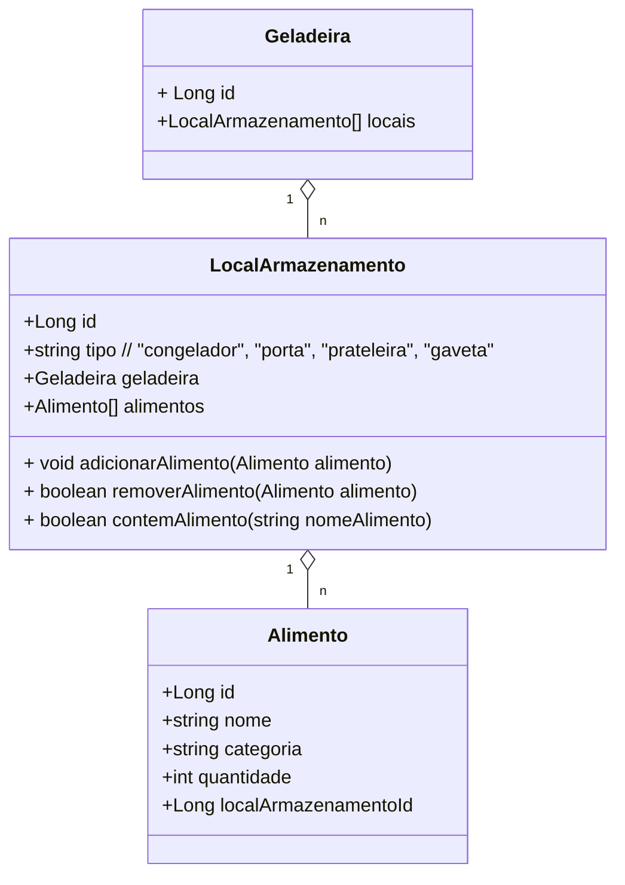

# Desafio Dio Bradesco 2025
Java RESTful API criada para desafio Bradesco

## Diagrama de Classes

```mermaid
classDiagram
    class Geladeira {
        + Long id
        +LocalArmazenamento[] locais
    }
    
    class LocalArmazenamento {
        +Long id
        +string tipo  // "congelador", "porta", "prateleira", "gaveta"
        +Geladeira geladeira
        +Alimento[] alimentos
        + void adicionarAlimento(Alimento alimento)
        + boolean removerAlimento(Alimento alimento)
        + boolean contemAlimento(string nomeAlimento)
    }
    
    class Alimento {
        +Long id
        +string nome
        +string categoria
        +int quantidade
        +Long localArmazenamentoId
    }

    Geladeira "1" o-- "n" LocalArmazenamento
    LocalArmazenamento "1" o-- "n" Alimento
```

